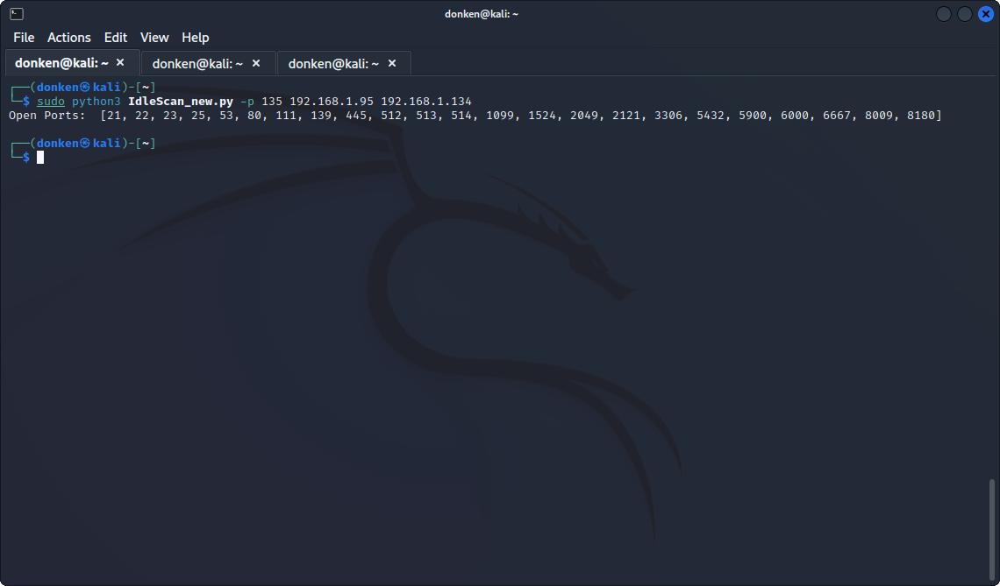
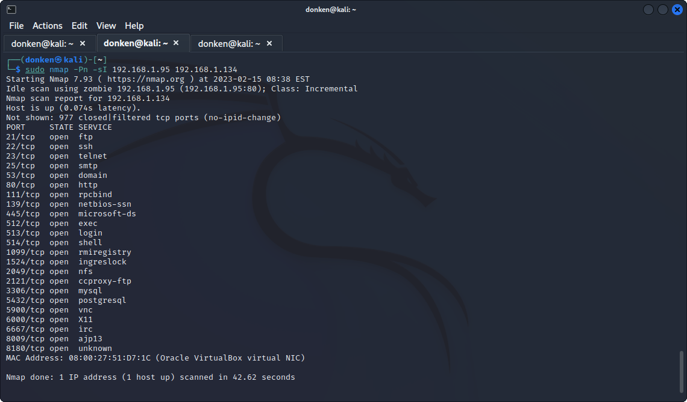

# Idle Scan using Scapy in Python 3
## Description
* This project implements the famous idle scan using Scapy in Python 3. 
* 1000 most common TCP ports are scanned. You can change these ports manually by editing the [TCP_1000.txt](TCP_1000.txt) file.
* The code checks a batch of 30 (or 100) ports in each iteration. If none of these ports are open, the code proceeds to the next batch. Otherwise, the window size is recursively reduced until the open port(s) is identified.
* The code runs for 2 epochs by default, i.e., closed ports are checked once more to make sure they are really closed.
* After all open ports are identified, the code proceeds to the verification phase, where it checks all the selected ports again to remove any randomness and make sure they are really open.
## Usage
* **Note:** Make sure to run the code with root privilages. Otherwise, it won't be able to send certain crafted packets.
* The usage is straightforward. Just run the code and provide the zombie and the target IP as input arguments:
```
sudo python3 IdleScan.py <Zombie_IP> <Target_IP>
```
## Additional Options
* Use `-p` to specify which port of the zombie device to use for the scan. Default is 80.
* Use `-e` to specify the number of epochs, i.e., how many times to check closed ports. Default is 2.
* Use `--maxchecks` to specify how many times to check the selected ports to make sure they are really open in the verification phase.
* Use `--minaccuracy` to specify the minimum accuracy ([0,1]). If a selected port is open at least (minaccuracy * maxchecks) times in the verification phase, it is marked as really open.

## Requirements
* You need to install Scapy before you can run this code. On Ubuntu, you can use the following command to install Scapy:
```
sudo apt install python3-scapy
```
## Performance Evaluation
* As you probably know, you can also use Nmap to perform idle scan via the following command:
```
sudo nmap -Pn -sI <Zombie_IP> <Target_IP>
```
* I evaluated the performance of my code and Nmap for several targets. 
* Based on the results, my code and Nmap have very similar performance. For instance, when I used [Metasploitable2 (Linux)](https://sourceforge.net/projects/metasploitable/) as the target and Windows XP as the zombie, both scripts were able to detect all the open ports successfully:
* My code's output:
* 
* Nmap Output:
* 